# Deploy an Orleans Cluster on Azure Container Apps

This repository contains an end-to-end sample and tutorial for getting a Microsoft Orleans cluster running on Azure Container Apps. Worker microservices rapidly transmit data to a back-end Orleans cluster for monitoring and storage, emulating thousands of physical devices in the field.

## What you'll do

Throughout this tutorial you'll complete the following tasks:

1. Use GitHub Actions, Bicep, and the Azure CLI to deploy a cloud-native .NET application to Azure Container Apps.
2. Monitor the app in real-time using the Orleans Dashboard.
3. Customize the cloud-native object behavior and placement throughout the cluster.
4. Simulate load by increasing the number of Worker services in the Azure portal.
5. Observe how the cluster automatically scales based on application behavior using a custom external scaler

Once the cluster is deployed, you can experiment with adding multiple revisions to simulate load on the cluster. 

> Note: Don't forget to delete your resources, or at least, scale them way back after trying.

## What you'll learn

This exercise will introduce you to a variety of concepts, with links to supporting documentation throughout the tutorial. 

* [Microsoft Orleans](https://docs.microsoft.com/dotnet/orleans)
* [Azure Container Apps](https://docs.microsoft.com/azure/container-apps/overview)
* [GitHub Actions](https://github.com/features/actions)
* [Azure Container Registry](https://docs.microsoft.com/azure/container-registry/)
* [Azure Bicep](https://docs.microsoft.com/azure/azure-resource-manager/bicep/overview?tabs=**bicep**)
* [Kubernetes Auto-driven Autoscaling (KEDA)](https://keda.sh/), [KEDA Scalers](https://keda.sh/docs/2.6/scalers/), specifically [External KEDA Scalers written using gRPC](https://keda.sh/docs/2.6/concepts/external-scalers/)

By the end, you'll be introduced to the world of distributed systems using Azure's newest container PaaS - Azure Container Apps - and .NET's cloud-native primitive - [Orleans Grains](https://docs.microsoft.com/dotnet/orleans/grains/).


## Prerequisites

You'll need an Azure subscription and a very small set of tools and skills to get started:

1. An Azure subscription. Sign up [for free](https://azure.microsoft.com/free/).
2. A GitHub account, with access to GitHub Actions.
3. Either the [Azure CLI](https://docs.microsoft.com/cli/azure/install-azure-cli) installed locally, or, access to [GitHub Codespaces](https://github.com/features/codespaces), which would enable you to do develop in your browser.


## Setup

By the end of this section you'll have a distributed Orleans cluster running in Azure. This setup process consists of two steps, and should take you around 15 minutes. 

1. Use the Azure CLI to create an Azure Service Principal, then store that principal's JSON output to a GitHub secret so the GitHub Actions CI/CD process can log into your Azure subscription and deploy the code.
2. Edit the ` deploy.yml` workflow file and push the changes into a new `deploy` branch, triggering GitHub Actions to build the .NET projects into containers and push those containers into a new Azure Container Apps Environment. 

Now you can do some experiments with Orleans in Azure Container Apps!


### Authenticate to Azure and configure the repository with a secret

1. Fork this repository to your own GitHub organization.
2. Create an Azure Service Principal using the Azure CLI. 

```bash
$subscriptionId=$(az account show --query id --output tsv)
az ad sp create-for-rbac --sdk-auth --name OrleansAcaSample --role contributor --scopes /subscriptions/$subscriptionId
```

3. Copy the JSON written to the screen to your clipboard. 

```json
{
  "clientId": "",
  "clientSecret": "",
  "subscriptionId": "",
  "tenantId": "",
  "activeDirectoryEndpointUrl": "https://login.microsoftonline.com/",
  "resourceManagerEndpointUrl": "https://brazilus.management.azure.com",
  "activeDirectoryGraphResourceId": "https://graph.windows.net/",
  "sqlManagementEndpointUrl": "https://management.core.windows.net:8443/",
  "galleryEndpointUrl": "https://gallery.azure.com",
  "managementEndpointUrl": "https://management.core.windows.net"
}
```

4. Create a new GitHub secret in your fork of this repository named `AzureSPN`. Paste the JSON returned from the Azure CLI into this new secret. Once you've done this you'll see the secret in your fork of the repository.

   

> Note: Never save the JSON to disk, for it will enable anyone who obtains this JSON code to create or edit resources in your Azure subscription. 


## Deploy the app using GitHub Actions (in 1 step!)

With your Azure account login stored as a secret in your fork of the repository, you can now provision new Azure resources. During this phase, you'll create these resources in your Azure subscription, simply by creating a small edit in a branch of the repository:

* An Azure Storage account, to be used for the Orleans Cluster's persistence and clustering capabilities. 
* An Azure Container Registry instance, which is used to store the container images you'll build using GitHub Actions' CI/CD features.
* A few Azure Container Apps, a scalable compute layer in which the code for the demo will run. 
* An Azure Log Analytics instance and an Azure Application Insights instance, which will collect telemetry and diagnostic information about your app.

You can either clone the repository and perform these steps locally, in a GitHub Codespace, or by simply creating a small edit to the `.github/workflows/deploy.yml` file and saving it to a new `deploy` branch in your fork of the repository right in your browser. Whatever option you choose, you'll be editing the top section of the `deploy.yml` file's content to set the name of the Azure resource group you want to house the resources the app will need:

```yaml
env:
  
  # alphanumeric string under 14 characters
  RESOURCE_GROUP_NAME: orleans-cluster-on-container-apps

  # specify your preferred region
  REGION: eastus
```

> Note: Azure Container Apps isn't available in all regions yet. Please use `eastus` or `canadacentral`. 


### Deploying directly from GitHub

The easiest way to provision your Azure resources is to directly edit the `.github/workflows/deploy.yml` file directly in your browser.


Change the `RESOURCE_GROUP_NAME` environment variable from `orleans-cluster-on-container-apps` to something shorter (8-10 characters, all lower-case letters and numbers). Then, commit the change to a new branch named `deploy`. 


### Observe the setup process

Browse to the `Actions` tab in your GitHub repository to see if the `deploy` CI/CD process started.

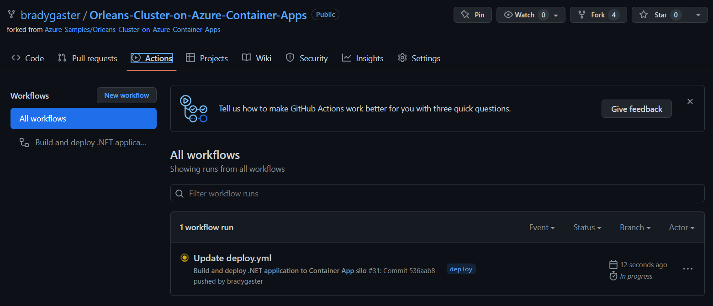

You can see the three phases the CI/CD process will execute:

1. First it will **provision** the Azure resources, described below in more detail. 
2. Then **build** will build the projects, the container images they'll run in, and push those images to Azure Container Registry.
3. Finally, deploy will execute and push the container images into their respective Azure Container App instances. 

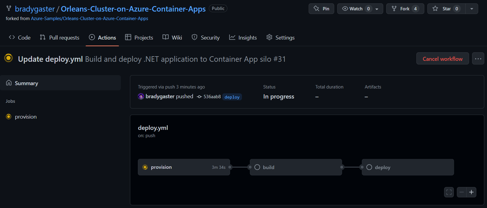

### The Azure Resources in the app

Once the `deploy` process completes, you'll get confirmation that each step of the CI/CD process has been executed in the GitHub Actions UI.

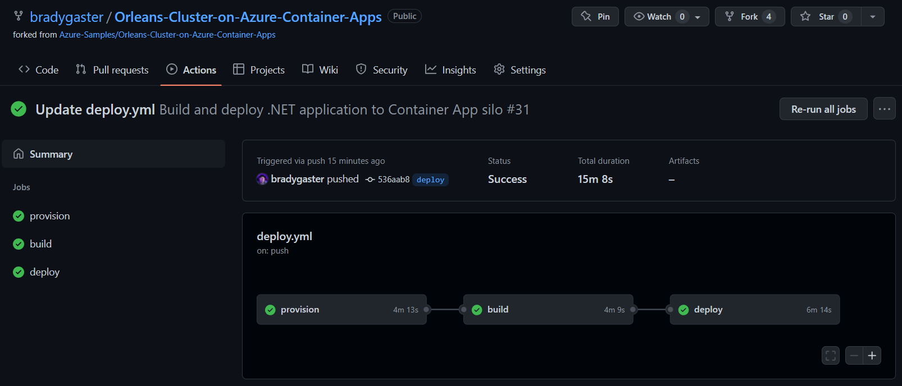

When the `provision` step completes, you'll see a few new Azure resources in your subscription.


Here's a breakdown of each of these services and their purpose in the app:

| Resource            | Resource Type                                                | Purpose                                                      |
| ------------------- | ------------------------------------------------------------ | ------------------------------------------------------------ |
| dashboard           | An Azure Container App that houses the code for the Orleans Dashboard. | The Orleans Dashboard is an open-source contribution from the active Orleans community that gives you deep visibility into how the Orleans cluster is running. |
| minimalapiclient    | An Azure Container App that houses the code for a minimal API. | This API is a Swagger UI-enabled client that sits on top of the Orleans cluster. It communicates within the Azure Container Apps Environment securely with all the Orleans Silos and exposes a front end on at https://container-app-ingress-FQDN/swagger. |
| silo                | An Azure Container App that houses the code for the Orleans Silo. | An Orleans "Silo" can be either an ASP.NET Core app, as in this project, or a Worker app. Silos host the Orleans Grain classes so the Orleans cluster and connected clients can access their data and behavior. |
| scaler              | An Azure Container App that houses the code for the external KEDA scaler gRPC service. | Azure Container Apps support a variety of KEDA scalers, which enable you to scale your app up and down. Included in this sample is an ASP.NET Core gRPC project that implements the [KEDA External Scaler](https://keda.sh/docs/2.6/concepts/external-scalers/) protobuf contract. ACA's internal controller repeatedly calls the KEDA scaler to see how many Grains are in the system. When the number of Grains-per-silo exceed 300, the scaler tells the ACA fabric to start another revision of the `silo` container app. |
| workerserviceclient | An Azure Container App that houses a .NET Core Worker Service project. | This worker service spins continuously and simulates an ever-running physical device that constantly transmits data to the back-end. Each instance of this container app will simulate 256 different devices sending messages in a very fast loop. |
| orleansonacaenv     | An Azure Container Apps Environment                          | This environment serves as the networking meta-container for all of the instances of all of the container apps I have running |
| orleansonacaacr     | An Azure Container Registry                                  | This is the container registry into which the CI/CD process publishes my application containers when I commit code to the `deploy` branch. From this registry, the containers are pulled and loaded into Azure Container Apps. |
| orleansonacaai      | Application Insights                                         | This provides telemetry and diagnostic information for when I want to monitor how the app is performing or for when things need troubleshooting. |
| orleansonacalogs    | Log Analytics Workspace                                      | This is where I can perform custom [Kusto](https://docs.microsoft.com/azure/data-explorer/kusto/query/) queries against the application telemetry, and time-sliced views of how the app is performing and scaling over time in the environment. |
| orleansonacastrg    | Azure Storage Account                                        | Microsoft Orleans has a variety of different [Persistence](https://docs.microsoft.com/dotnet/orleans/grains/grain-persistence/) providers, the most popular and easiest-to-use of which is the [Azure Storage provider](https://docs.microsoft.com/dotnet/orleans/grains/grain-persistence/azure-storage). The clever [Orleans persistence APIs](https://docs.microsoft.com/dotnet/orleans/grains/grain-persistence/#api) allow you to spend more time innovating how the objects in your app work together rather than the innerworkings of the queries persisting their state. Orleans handles your object state for you securely, performantly, and transactionally. |

Now that the resources have been deployed and the code is running in the Azure Container Environment, you can see how the app's running, scale it out, and perform some experiments to see how Orleans enables distributed processing in a cloud-native environment and how Azure Container Apps enables auto-scaling using KEDA. 


## View the Orleans Dashboard

Go back into the Azure portal, and click on the `dashboard` Container App to open it up in the `Overview` blade in the portal. On open, click the `Application URL` link to open the dashboard in your browser. The Orleans Dashboard opens up, presenting a quick view of all the Orleans Grains in the system, most of which are being called from the Worker Service client. 


You can customize what you see in the dashboard, filtering out only the grains you want to see. By turning off the Dashboard and System Grains, you can set the dashboard's view such that only those objects in your application domain are visible. 


Now, the Orleans Dashboard will show you only the Grains relevant to your app; the system and dashboard grains are now hidden (and this second screen shot shows how the dashboard looks in dark mode, so you have an option to see both views). 


Remember that earlier when we described each service, we mentioned the `workerserviceclient` container's job was to simulate 256 physical device peers that constantly send data into the cluster's back end. That's why there are 256 total activations; since there is 1 `workerserviceclient` container running in the environment and each worker represents 256 devices, there are 256 grains in the cluster, and they are all of type `SensorTwinGrain`. Looking at the Grains tab in the dashboard, you can see how Orleans creates these instances in the `silo` or in the `dashboard`; this is because the `dashboard` project also has a reference to the `Grains` project, so the Grain classes are instantiated in the `dashboard` as well as in the `silo` container app. 


### Customizing Grain Placement

If you'd prefer to prohibit Grains from appearing in any specific silo, there are numerous options for enabling Grain placement customization, and the Orleans documentation is a good resource to learn how to use the [various placement directors](https://docs.microsoft.com/dotnet/orleans/grains/grain-placement). In most cases, allowing Orleans to place Grains throughout silos in the cluster is the best course of action. 

In scenarios like prohibiting grains from appearing in the Dashboard silo, for instance, simply remove a reference from the `Grains` project, and the silo can't create instances of the Grain classes. 

```xml

 <ItemGroup>
    <ProjectReference Include="..\Abstractions\Abstractions.csproj" />
    <ProjectReference Include="..\Grains\Grains.csproj" /> <!-- remove this line in the Dashboard.csproj --> 
    <ProjectReference Include="..\Infrastructure\Infrastructure.csproj" />
  </ItemGroup>
```

### Explicit Grain placement

Alternatively, if you want explicit control over placement, you can implement the `IPlacementDirector` and `PlacementStrategy` classes as shown in the example code (also in the repository). 

```csharp
using Orleans;
using Orleans.Placement;
using Orleans.Runtime;
using Orleans.Runtime.Placement;

namespace Grains
{
    public class DontPlaceMeOnTheDashboardSiloDirector : IPlacementDirector
    {
        public IGrainFactory GrainFactory { get; set; }
        public IManagementGrain ManagementGrain { get; set; }

        public DontPlaceMeOnTheDashboardSiloDirector(IGrainFactory grainFactory)
        {
            GrainFactory = grainFactory;
            ManagementGrain = GrainFactory.GetGrain<IManagementGrain>(0);
        }

        public async Task<SiloAddress> OnAddActivation(PlacementStrategy strategy, PlacementTarget target, IPlacementContext context)
        {
            var activeSilos = await ManagementGrain.GetDetailedHosts(onlyActive: true);
            var silos = activeSilos.Where(x => !x.RoleName.ToLower().Contains("dashboard")).Select(x => x.SiloAddress).ToArray();
            return silos[new Random().Next(0, silos.Length)];
        }
    }

    [Serializable]
    public sealed class DontPlaceMeOnTheDashboardStrategy : PlacementStrategy
    {
    }

    [AttributeUsage(AttributeTargets.Class, AllowMultiple = false)]
    public sealed class DontPlaceMeOnTheDashboardAttribute : PlacementAttribute
    {
        public DontPlaceMeOnTheDashboardAttribute() :
            base(new DontPlaceMeOnTheDashboardStrategy())
        {
        }
    }
}

```

In the `Dashboard` project's `Program.cs` file, you'll see a line that's commented out that uses custom middleware in the `Grains` project's `DontHostGrainsHereServiceCollectionExtensions.cs` file. To enable this and prohibit placement on the `dashboard` (or any other silo), uncomment the line as such:

```csharp
// uncomment this if you dont mind hosting grains in the dashboard
builder.Services.DontHostGrainsHere();
```

Feel free to explore the code in the `Grains` project's `DontHostGrainsHereServiceCollectionExtensions.cs` file to learn more about how Orleans wires up services and middleware to make use of these attributes if that level of control is something you're after. 

With these classes implemented, any Grain you want to prohibit from appearing in the `dashboard` silo can be achieved by simply decorating the Grain with the `DontPlaceMeOnTheDashboard` attribute. 

```csharp
[CollectionAgeLimit(Minutes = 2)]
[DontPlaceMeOnTheDashboard]
public class SensorTwinGrain : Grain, ISensorTwinGrain
{
    public ILogger<SensorTwinGrain> Logger { get; set; }

    public SensorTwinGrain(ILogger<SensorTwinGrain> logger) => Logger = logger;

    public async Task ReceiveSensorState(SensorState sensorState) => 
        await Task.Run(() => Logger.LogInformation($"Received value of {sensorState.Value} for {sensorState.Type} state reading from sensor {this.GetGrainIdentity().PrimaryKeyString}"));
}
```

#### Optional Exercise

Using Visual Studio or Visual Studio Code (or the command line) you could make this change to the code and push the `silo` and `dashboard` containers up to your Azure Container Registry. Shown below post-publish, Visual Studio offers simple one-click publish experience to ACR instances, so when you're getting started or developing something new, this is a handy way to try changes out quickly. 

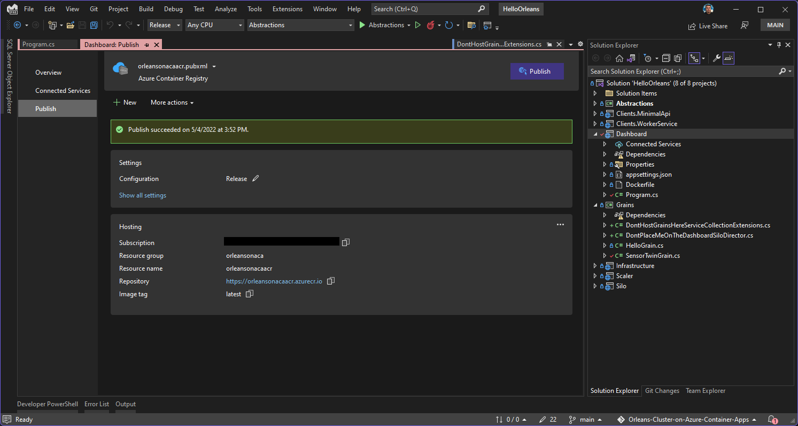

Once you've updated the image in ACR, you can easily create a new revision from that `latest` image revision, and update the way the `dashboard` hosts (or in this case, *stops* *hosting*) Grains. This is easy in the portal, shown below after being updated from Visual Studio, which places the images in the ACR instance with the `latest` tag. 

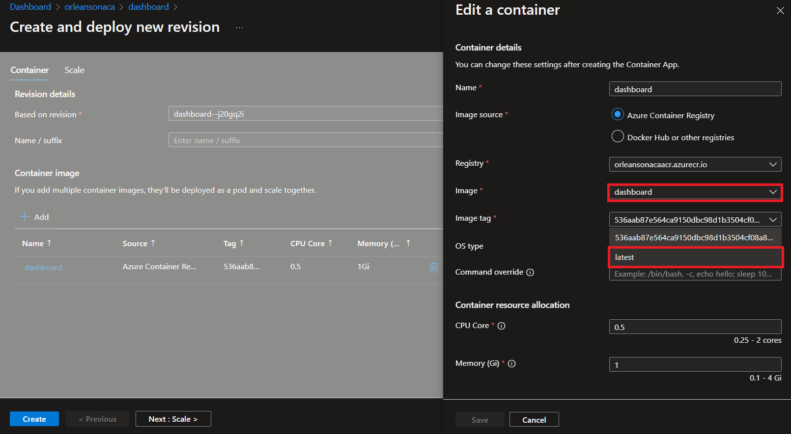

Once the `silo` and `dashboard` containers are updated like this, the custom placement director will take affect, and grains will no longer be placed in the `dashboard`. 

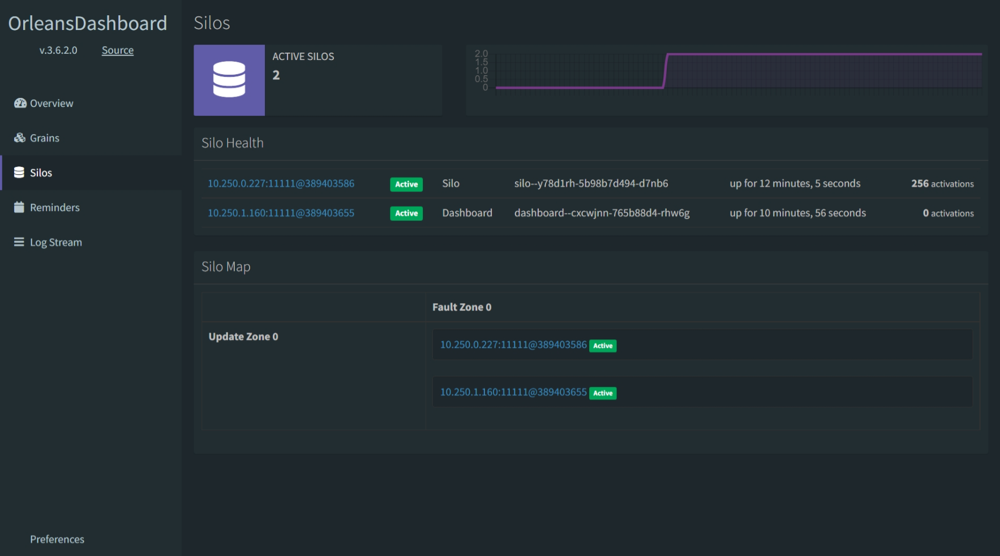

### Orleans Grain lifetimes

In the example code, there are two Orleans Grain interfaces and implementations. One of these, the `SensorTwinGrain`, represents a canonical use-case for Orleans applications - IoT (Internet of Things) Digital Twin scenarios. Orleans' low latency is fantastic for these types of scenarios. In this phase of the tutorial, we'll demonstrate how Orleans automatically cleans up the Grains in the cluster's Silos when they go unused for a set period of time. 

```csharp
[CollectionAgeLimit(Minutes = 2)]
[DontPlaceMeOnTheDashboard]
public class SensorTwinGrain : Grain, ISensorTwinGrain
{
}
```

The `SensorTwinGrain` is decorated with [CollectionAgeLimitAttribute](https://docs.microsoft.com/dotnet/api/orleans.configuration.collectionagelimitattribute?view=orleans-3.0), useful when you want to explicitly control how long a Grain is maintained in memory when it isn't actively being called by any other Grains in the cluster or by any clients. In the next section we'll take a look at how you can turn off the client simulation and observe Orleans clean up the unused Grains in the cluster. Then, we'll scale the cluster out, and see what happens when a single client calls a distributed Orleans cluster. Finally, we'll scale out the front-end simulation and demonstrate how Azure Container Apps is a scalable compute layer for your Orleans infrastructure. 

## Simulating a drop in traffic

The `workerserviceclient` is how the app generates fake traffic, so let's turn all the revisions for this Azure Container App off in the Azure portal. Just uncheck all the revisions, and then click the `Save` button. 

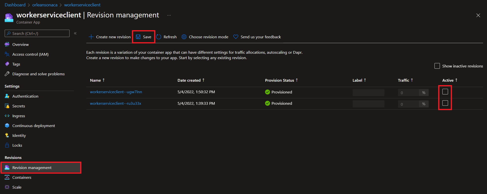

Since the grain lifetime is set to 2 minutes, you should start seeing grains vanish from the cluster just after 2 minutes from hitting the `Save` button on the revision management page. 

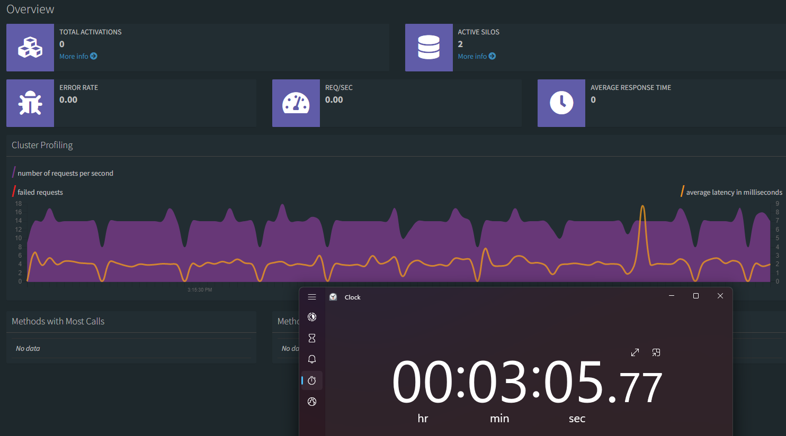

Eventually, the `TOTAL ACTIVATIONS` label will drop to 0 as shown here. The silos are still in the cluster awaiting their purpose - to host Grains - so in the next step, you'll scale the `workerserviceclient` up, rather than down, to simulate far more than the 300-Grains-per-silo threshold we've configured the app to support. 

> Note: this 300 limit is in no way a recommendation, but rather a contrived example to show how Orleans distributes Grain instances throughout a cluster. One silo could host tens of thousands or more - there's no official guidance, but Orleans provides you a multitude of ways to tune cluster behavior. 

## Simulating heavy traffic with a scaled-out revision

In the Azure portal, create a new revision of the `workerserviceclient` Azure Container App, and scale it all the way up to 10. 

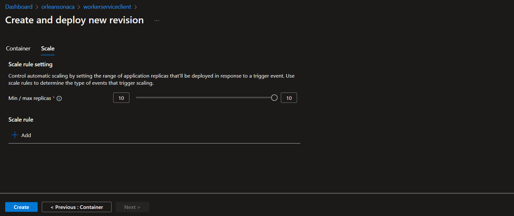

Now, when the revision spins up we'll receive the simulation of an surge in traffic. This surge in clients will create 2560 Grains in the cluster, which is currently staffed by a single `silo`. As soon as that load starts, the KEDA External Scaler implemented and running in the `scaler` container app notices and lets the fabric know the `silo` count is lower than the 300-Grains-per-silo limit, so Azure Container Apps automatically starts scaling the `silo` container app up. 

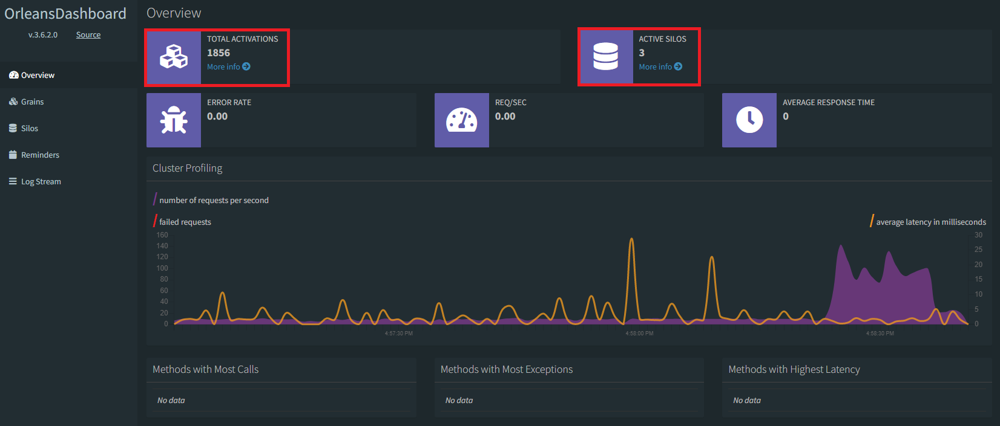

Eventually the simulation reaches a peak and the maximum number of grains represented by 11 clients will be spread across the silos that came online during the surge. 

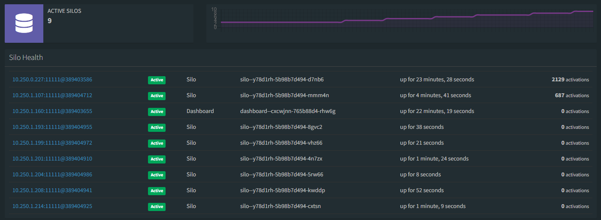

If you'd like to see how a third set of clients (1 being the single, 2 being our 10x client revision) would be distributed across the existing silo revision, create a third revision of the `workerserviceclient` container app. 

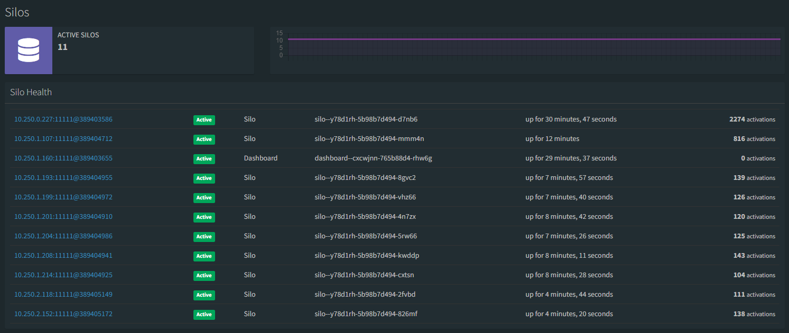

Now that we've seen how a surge in client behavior can easily be accommodated by my custom KEDA scaling implementation, let's turn the simulation all the way to zero. 

### Scaling to zero

With the load simulation over, scale the `workserviceclient` revisions back to zero active ones. Shut each one off in the portal until you see the `Create new revision` button in the portal. 

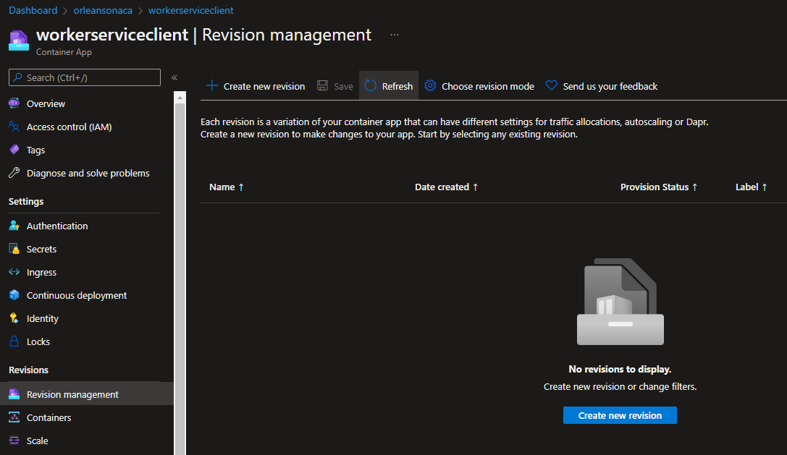

First, you'll observe all the Grains activated in the cluster drop gradually to zero:


After a few minutes (around 10 in author's test cases), the KEDA scaler will begin to scale instances back down after around 10 minutes. By then all the grains will be long gone, so if you want to test a more gradual back-off, try creating smaller revisions of the `workerserviceclient` when you try this sample. 

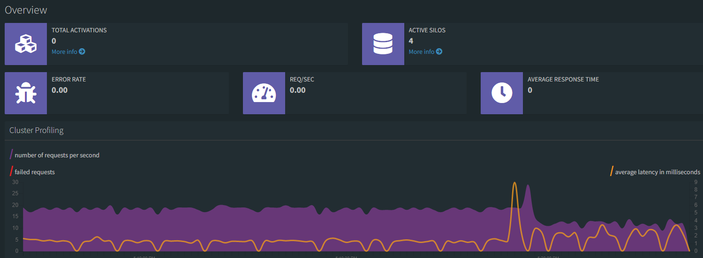

Eventually the `silo` count will get to 1, and as always, the `dashboard` will remain at 1, and you'll have a fresh new cluster in which you can try new things, create new Grains, and see how things work. 

## Summary

In this tutorial you created a self-scaling Orleans cluster that runs inside of Azure Container Apps, using KEDA to automatically scale as needed, based on what you know your app can do. You can observe your app using Application Insights monitoring - see below for the final treat, an Application Map that shows the entire topology and traffic flow through the Orleans cluster in Azure Container Apps. Use this great telemetry to think of ways you can use Orleans and Azure Container Apps together to build your own enterprise-grade distributed topologies with cloud-native objects and .NET. 

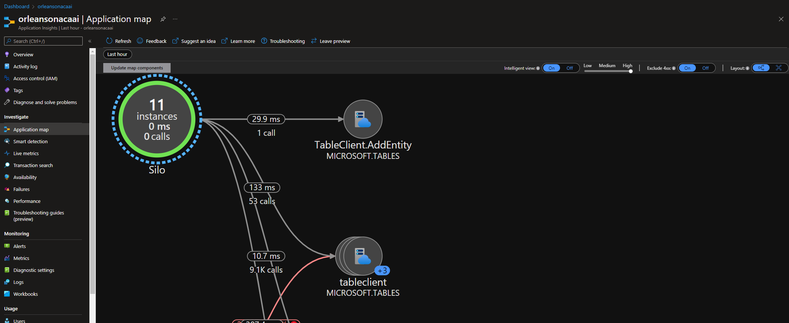

Final note - to find the `ILogger<T>` output from throughout the various container apps in one single place, open up the Log Analytics Workspace resource, and go into the `Logs` menu item. There, you can query directly against the combined application components' log output. This final screen shot shows how I can look at the logs output from the `scaler` service, if I'm keen to try to understand the behavior it plans on executing. 

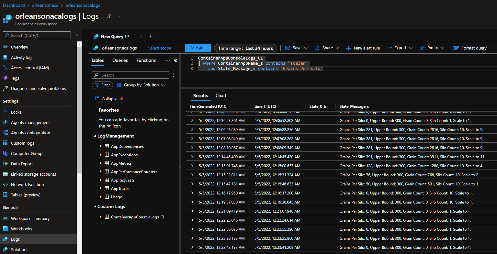

Happy coding!

> Note: Don't forget to delete your resources, or at least, scale them way back. You can delete the resources using `az group delete --resource-group orleans-cluster-on-container-apps` (or whatever you named your resource group to when editing deploy.yml to force the deployment), followed by browsing to the Azure Portal, searching for OrleansACASample, and deleting the Azure AD App registration. Thanks for trying this sample.
