# Deploy an Orleans Cluster on Azure Container Apps

This repository contains an end-to-end sample and tutorial for getting a Microsoft Orleans cluster running on Azure Container Apps. Worker microservices rapidly transmit data to a back-end Orleans cluster for monitoring and storage, emulating thousands of physical devices in the field.

## What you'll do

Throughout this tutorial you'll complete the following tasks:

1. Use GitHub Actions, Bicep, and the Azure CLI to deploy a cloud-native .NET application to Azure Container Apps.
2. Monitor the app in real-time using the Orleans Dashboard.
3. Simulate load by increasing the number of Worker services in the Azure portal.
4. Scale the back end out.
5. Scale the simulation back to zero client load.
6. Scale the back end down to a minimal load.


## What you'll learn

This exercise will introduce you to a variety of concepts, with links to supporting documentation throughout the tutorial. 

* [Microsoft Orleans](https://docs.microsoft.com/dotnet/orleans)
* [Azure Container Apps](https://docs.microsoft.com/azure/container-apps/overview)
* [GitHub Actions](https://github.com/features/actions)
* [Azure Container Registry](https://docs.microsoft.com/azure/container-registry/)
* [Azure Bicep](https://docs.microsoft.com/azure/azure-resource-manager/bicep/overview?tabs=**bicep**)

By the end, you'll be introduced to the world of distributed systems using Azure's newest container PaaS - Azure Container Apps - and .NET's cloud-native primitive - [Orleans Grains](https://docs.microsoft.com/dotnet/orleans/grains/).


## Prerequisites

You'll need an Azure subscription and a very small set of tools and skills to get started:

1. An Azure subscription. Sign up [for free](https://azure.microsoft.com/free/).
2. A GitHub account, with access to GitHub Actions.
3. Either the [Azure CLI](https://docs.microsoft.com/cli/azure/install-azure-cli) installed locally, or, access to [GitHub Codespaces](https://github.com/features/codespaces), which would enable you to do develop in your browser.


## Setup

By the end of this section you'll have a distributed Orleans cluster running in Azure. This setup process consists of three steps, and should take you around 15 minutes. 

1. Use the Azure CLI to create an Azure Service Principal, then store that principal's JSON output to a GitHub secret so the GitHub Actions CI/CD process can log into your Azure subscription and deploy the code.
2. Edit the ` provision.yml` workflow file that is used to provision the Azure resources and push that into a new `provision` branch, triggering GitHub Actions to execute the `provision` workflow step, which logs into Azure and creates the resources. 
3. Edit the ` deploy.yml` workflow file and push the changes into a new `deploy` branch, triggering GitHub Actions to build the .NET projects into containers and push those containers into a new Azure Container Apps Environment. 
4. Experiment with Orleans in Azure Container Apps!


### Authenticate to Azure and configure the repository with a secret

1. Fork this repository to your own GitHub organization.
2. Create an Azure Service Principal using the Azure CLI. 

```bash
$subscriptionId=$(az account show --query id --output)
az ad sp create-for-rbac --sdk-auth --name OrleansAcaSample --role contributor --scopes /subscriptions/$subscriptionId
```

3. Copy the JSON written to the screen to your clipboard. 

```json
{
  "clientId": "",
  "clientSecret": "",
  "subscriptionId": "",
  "tenantId": "",
  "activeDirectoryEndpointUrl": "https://login.microsoftonline.com/",
  "resourceManagerEndpointUrl": "https://brazilus.management.azure.com",
  "activeDirectoryGraphResourceId": "https://graph.windows.net/",
  "sqlManagementEndpointUrl": "https://management.core.windows.net:8443/",
  "galleryEndpointUrl": "https://gallery.azure.com",
  "managementEndpointUrl": "https://management.core.windows.net"
}
```

4. Create a new GitHub secret in your fork of this repository named `AzureSPN`. Paste the JSON returned from the Azure CLI into this new secret. Once you've done this you'll see the secret in your fork of the repository.

   

> Note: Never save the JSON to disk, for it will enable anyone who obtains this JSON code to create or edit resources in your Azure subscription. 


## Provision the Azure resources

With your Azure account login stored as a secret in your fork of the repository, you can now provision new Azure resources. During this phase, you'll create these resources in your Azure subscription, simply by creating a small edit in a branch of the repository:

* An Azure Storage account, to be used for the Orleans Cluster's persistence and clustering capabilities. 
* An Azure Container Registry instance, which is used to store the container images you'll build using GitHub Actions' CI/CD features.
* A few Azure Container Apps, a scalable compute layer in which the code for the demo will run. 
* An Azure Log Analytics instance and an Azure Application Insights instance, which will collect telemetry and diagnostic information about your app.

You can either clone the repository and perform these steps locally, in a GitHub Codespace, or by simply creating a small edit to the `.github/workflows/provision.yml` file and saving it to a new `provision` branch in your fork of the repository right in your browser. Whatever option you choose, you'll be editing the top section of the `provision.yml` file's content to set the name of the Azure resource group you want to house the resources the app will need:

```yaml
env:
  RESOURCE_GROUP_NAME: orleansoncontainerapps
  REGION: eastus
```

> Note: Azure Container Apps isn't available in all regions yet. Please use `eastus` or `canadacentral`. 


### Provisioning directly from GitHub

The easiest way to provision your Azure resources is to directly edit the `.github/workflows/provision.yml` file directly in your browser.

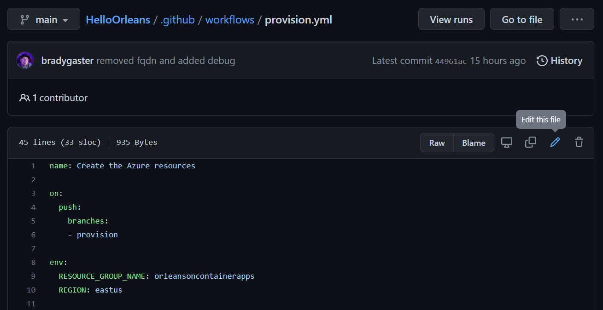


Change the `RESOURCE_GROUP_NAME` environment variable from `orleansoncontainerapps` to something shorter (8-10 characters, all lower-case letters and numbers). Then, commit the change to a new branch named `provision`. 

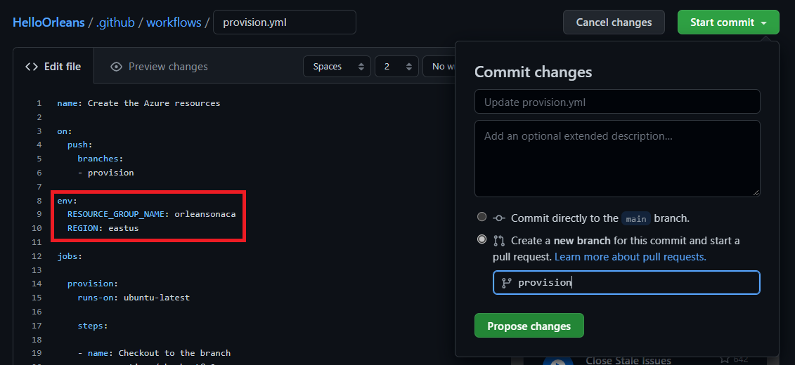


### Observe the provisioning process

Browse to the `Actions` tab in your GitHub repository to see if the `provision` CI/CD process started.

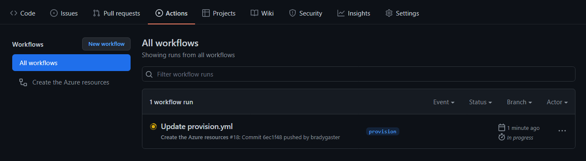


The provisioning process has the `--debug` flag enabled, so you'll be able to see the details of each step in detail.

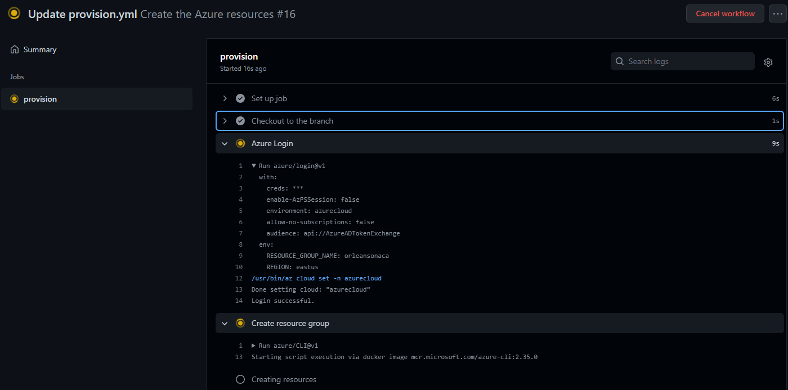


### The Azure Resources in the app

When the `provision` step completes, you'll see a few new Azure resources in your subscription.

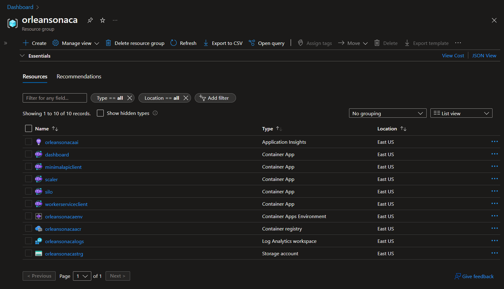


Here's a breakdown of each of these services and their purpose in the app:

| Resource            | Resource Type                                                | Purpose                                                      |
| ------------------- | ------------------------------------------------------------ | ------------------------------------------------------------ |
| dashboard           | An Azure Container App that houses the code for the Orleans Dashboard. | The Orleans Dashboard is an open-source contribution from the active Orleans community that gives you deep visibility into how the Orleans cluster is running. |
| minimalapiclient    | An Azure Container App that houses the code for a minimal API. | This API is a Swagger UI-enabled client that sits on top of the Orleans cluster. It communicates within the Azure Container Apps Environment securely with all the Orleans Silos and exposes a front end on at https://container-app-ingress-FQDN/swagger. |
| silo                | An Azure Container App that houses the code for the Orleans Silo. | An Orleans "Silo" can be either an ASP.NET Core app, as in this project, or a Worker app. Silos host the Orleans Grain classes so the Orleans cluster and connected clients can access their data and behavior. |
| workerserviceclient | An Azure Container App that houses a .NET Core Worker Service project. | This worker service spins continuously and simulates an ever-running physical device that constantly transmits data to the back-end. Each instance of this container app will simulate 100 different devices sending messages at 100ms intervals. |
| orleansonacaenv     | An Azure Container Apps Environment                          | This environment serves as the networking meta-container for all of the instances of all of the container apps I have running |
| orleansonacaacr     | An Azure Container Registry                                  | This is the container registry into which the CI/CD process publishes my application containers when I commit code to the `deploy` branch. From this registry, the containers are pulled and loaded into Azure Container Apps. |
| orleansonacaai      | Application Insights                                         | This provides telemetry and diagnostic information for when I want to monitor how the app is performing or for when things need troubleshooting. |
| orleansonacalogs    | Log Analytics Workspace                                      | This is where I can perform custom [Kusto](https://docs.microsoft.com/azure/data-explorer/kusto/query/) queries against the application telemetry, and time-sliced views of how the app is performing and scaling over time in the environment. |
| orleansonacastrg    | Azure Storage Account                                        | Microsoft Orleans has a variety of different [Persistence](https://docs.microsoft.com/dotnet/orleans/grains/grain-persistence/) providers, the most popular and easiest-to-use of which is the [Azure Storage provider](https://docs.microsoft.com/dotnet/orleans/grains/grain-persistence/azure-storage). The clever [Orleans persistence APIs](https://docs.microsoft.com/dotnet/orleans/grains/grain-persistence/#api) allow you to spend more time innovating how the objects in your app work together rather than the innerworkings of the queries persisting their state. Orleans handles your object state for you securely, performantly, and transactionally. |

Once the `provision` process completes, you can create a second branch in the repository named `deploy`, which you'll use to deploy code into the environment each time you're ready to update it. 


## Deploy code into the environment

The simplest way to do this is right in your browser, by browsing to the `.github/workflows/deploy.yml` file and clicking the pencil. 

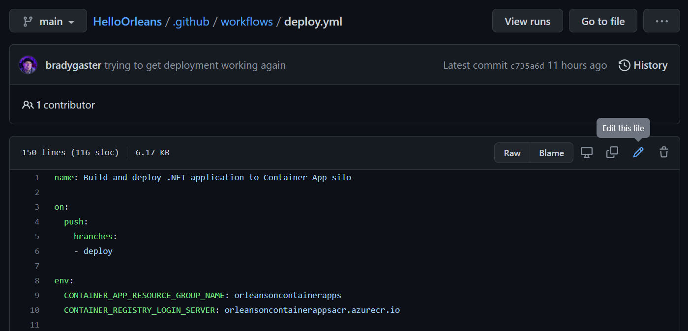


Change the resource group name and Azure Container Registry name environment variables to match the resource group and ACR resource name from the provision step. Then, commit the change to a new branch named `deploy` right in your browser. 

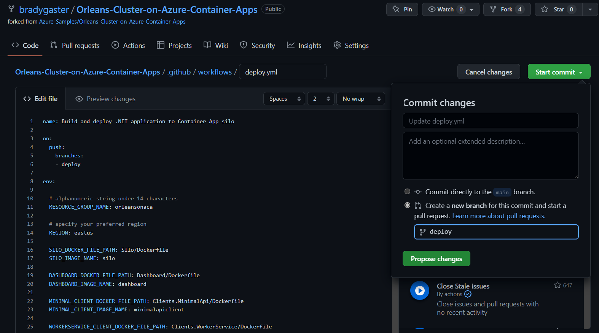


Once the change is pushed, click on the Actions tab and you'll see `build` step of the `deploy` workflow starting. 

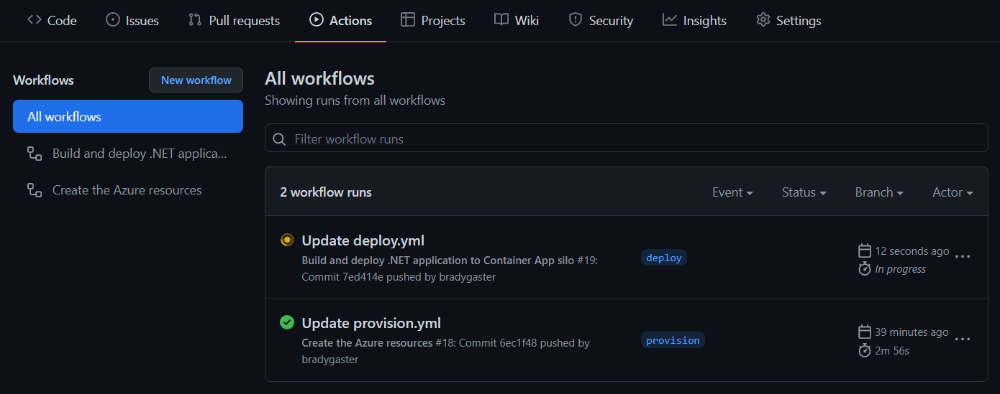


Once `build` completes, your container images will be in your ACR repository. Then, the final step, `deploy`, begins. 

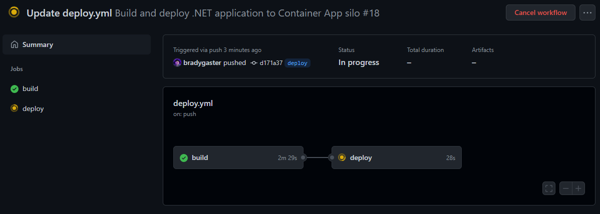


Each pf the 4 images are deployed into individual Azure Container Apps, right from GitHub Actions. 

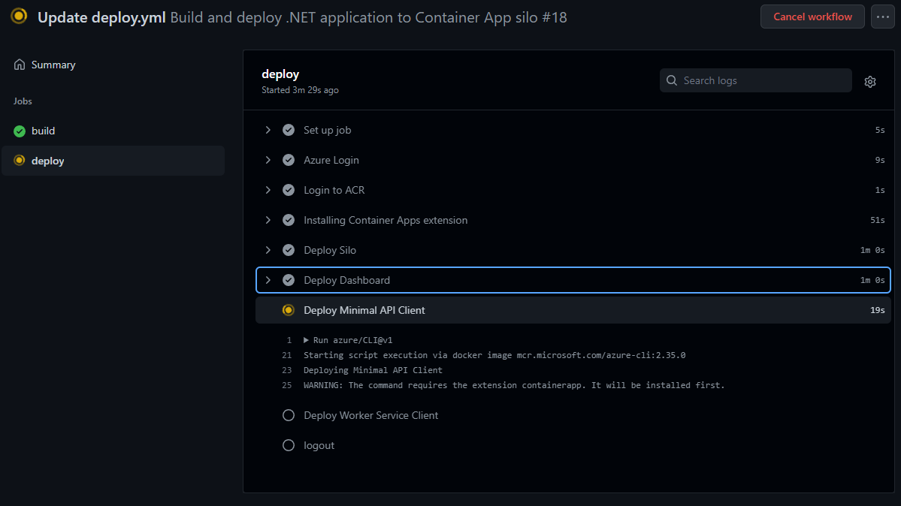


After a few minutes these two steps will complete. 

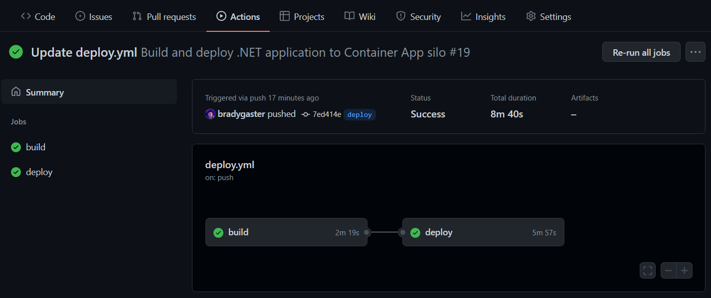


Now that the resources have been deployed and the code is running in the Azure Container Environment, you can see how the app's running, scale it out, and perform some experiments to see how Orleans enables distributed processing in a cloud-native environment and how Azure Container Apps makes it easy to scale on demand. 

## View the Orleans Dashboard

Go back into the Azure portal, and click on the `dashboard` Container App to open it up in the `Overview` blade in the portal. One open, click the `Application URL` link to open the dashboard in your browser. The Orleans Dashboard opens up, presenting a quick view of all the Orleans Grains in the system, most of which are being called from the Worker Service client. 

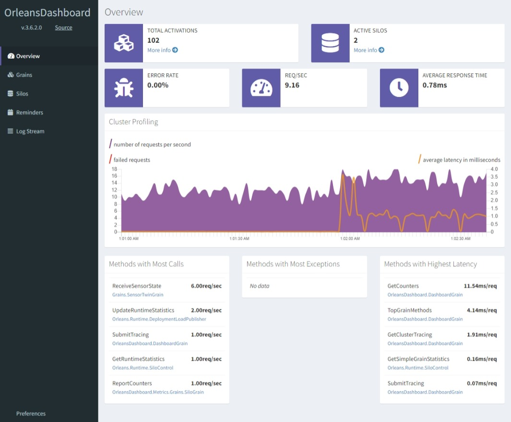


You can customize what you see in the dashboard, filtering out only the grains you want to see. By turning off the Dashboard and System Grains, you can set the dashboard's view such that only those objects in your application domain are visible. 

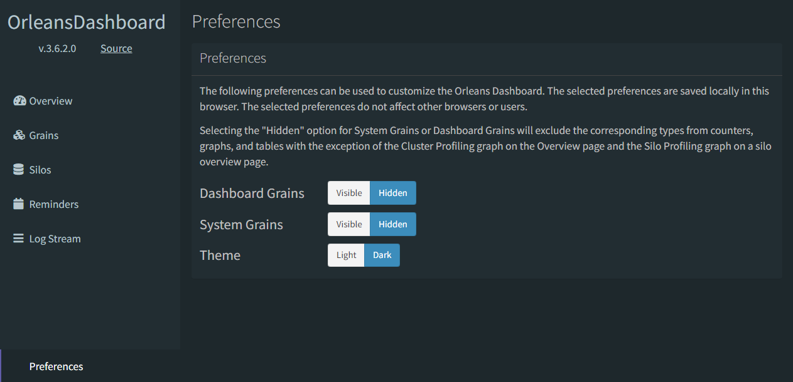


Now, the Orleans Dashboard will show you only the Grains relevant to your app; the system and dashboard grains are now hidden (and this second screen shot shows how the dashboard looks in dark mode, so you have an option to see both views). 

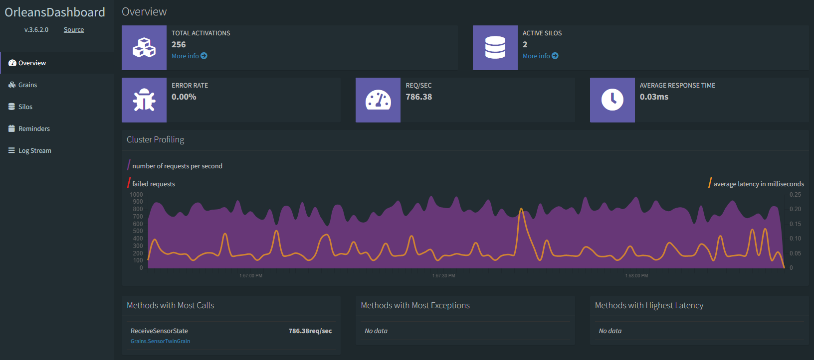


Remember that earlier when we described each service, we mentioned the `workerserviceclient` container's job was to simulate 100 physical device peers that constantly send data into the cluster's back end. That's why there are 100 total activations; since there is 1 `workerserviceclient` container running in the environment and each worker represents 100 devices, there are 100 grains in the cluster, and they are all of type `SensorTwinGrain`. Looking at the Grains tab in the dashboard, you can see how Orleans creates all of these instances in the `silo` container, and none in the `dashboard` container; this is because the `dashboard` project lacks a reference to the `Grains` project, so none of the Grain classes are instantiated in the `dashboard`. This enables us to turn the dashboard container on and off when we need to get a snapshot of what's happening in the cluster. 

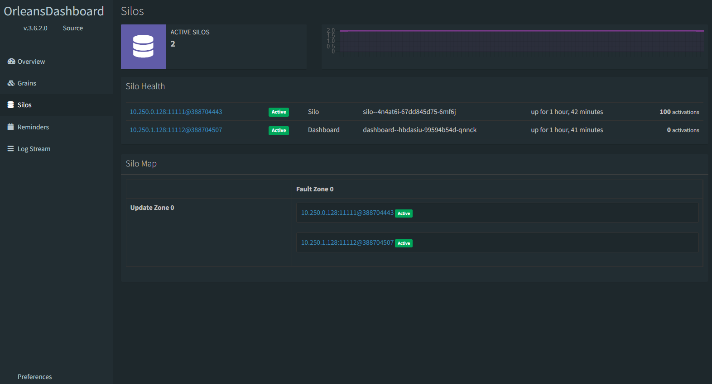


Azure Container Apps offers great scaling capabilities, that when coupled with Orleans, enable you to scale effortlessly up and down on demand. The next section will introduce you to these features and how they work together to enable scalable solutions with Orleans and Azure Container Apps. 


## Orleans Grain lifetimes

In the example code, there are two Orleans Grain interfaces and implementations. One of these, the `SensorTwinGrain`, represents a canonical use-case for Orleans applications - IoT (Internet of Things) Digital Twin scenarios. Orleans' low latency is fantastic for these types of scenarios. In this phase of the tutorial, we'll demonstrate how Orleans automatically cleans up the Grains in the cluster's Silos when they go unused for a set period of time. 

```csharp
[CollectionAgeLimit(Minutes = 2)]
public class SensorTwinGrain : Grain, ISensorTwinGrain
{
}
```

The `SensorTwinGrain` is decorated with [CollectionAgeLimitAttribute](https://docs.microsoft.com/dotnet/api/orleans.configuration.collectionagelimitattribute?view=orleans-3.0), useful when you want to explicitly control how long a Grain is maintained in memory when it isn't actively being called by any other Grains in the cluster or by any clients. In the next section we'll take a look at how you can turn off the client simulation and observe Orleans clean up the unused Grains in the cluster. Then, we'll scale the cluster out, and see what happens when a single client calls a distributed Orleans cluster. Finally, we'll scale out the front-end simulation and demonstrate how Azure Container Apps is a scalable compute layer for your Orleans infrastructure. 

